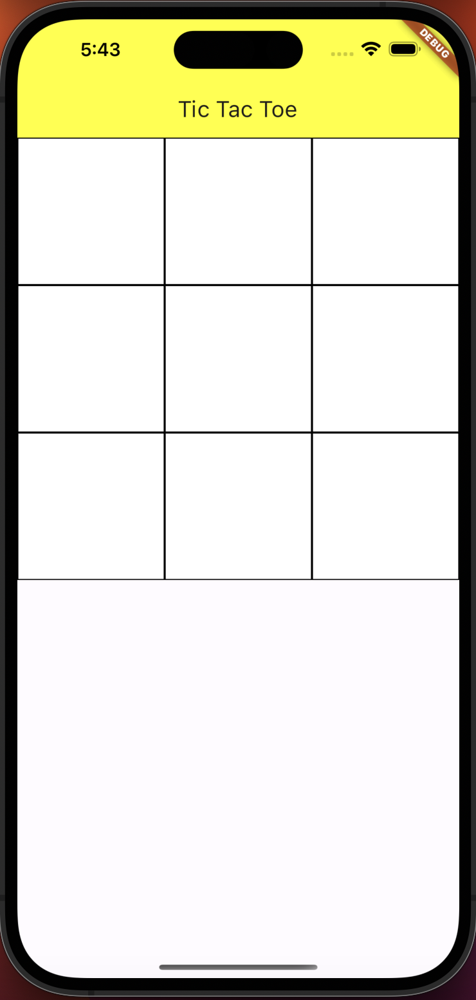
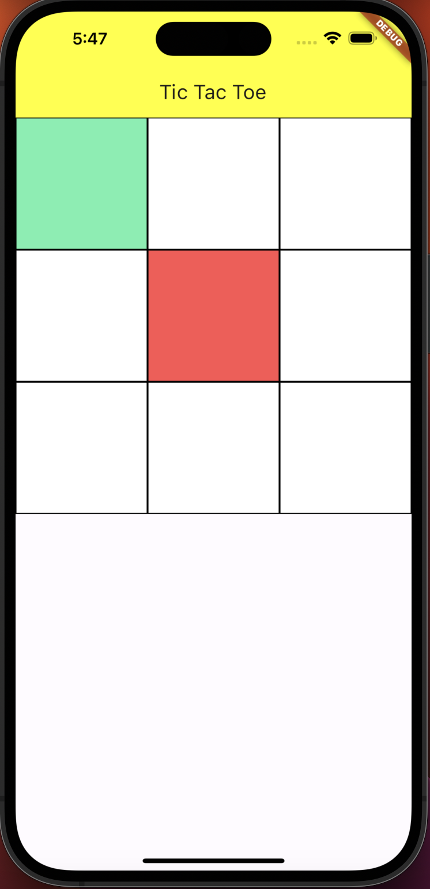

# homework4 - Tic Tac Toe

This app allows two players to have a friendly clasic game of tic tac toe

The rules are simple: Try to draw a winning combination: full row/column/diagonal
## Flow of the app

- Initial Screen
  - 
- After each tap on the squares, they will be colored green/red differentiating the players.
  - 
- After a winning combination, a message will appear indicating which player won.
- Only the winning combination will remain on the board
- A button also allows players to play again
  - 
- If all spaces have been filled and no winner is determined, a message will appear stating that it is an even game.
- A button also allows players to play again
  - 